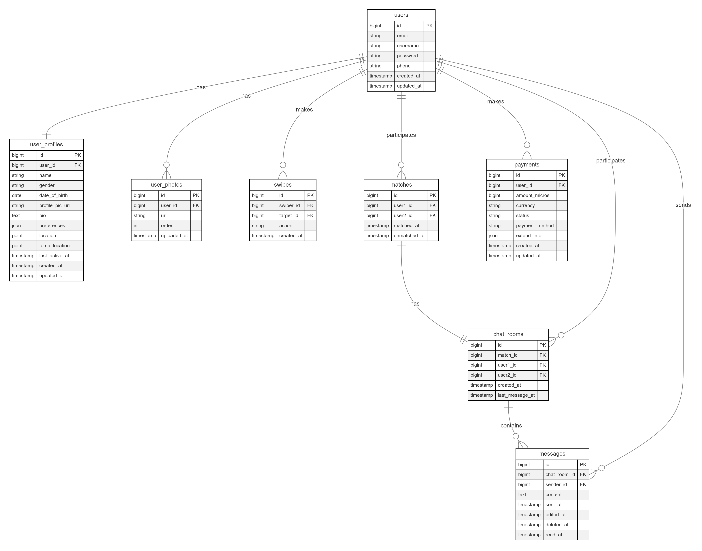
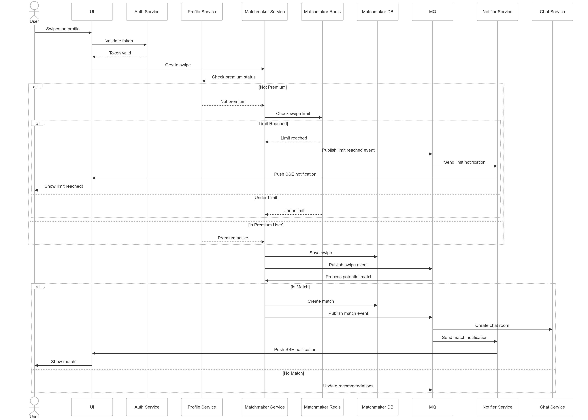
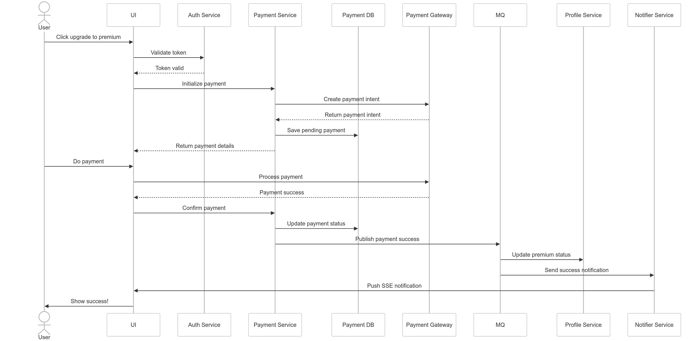

# Couply

A dating app concept by Tanricko

## GitHub Repository

<https://github.com/wendao2000/couply>

## Functional Requirements

### 1. Authentication

- Sign Up
  - Email registration
  - SSO (Google, Apple, etc.)
- Login
  - Email/password
  - Phone/OTP
  - SSO
- Password management (reset, change)

### 2. User Management

- Profile CRUD
  - Basic info
  - Photos
  - Preferences
- Account roles
  - Free user (10 swipes/day)
  - Premium user (unlimited swipes)

### 3. Matching System

- Swipe functionality
  - Like/Dislike recording
  - Swipe limit enforcement
  - 24-hour profile cooldown
- Matching algorithm
  - Real-time match generation
  - Preference-based filtering
  - Learning from user actions

### 4. Chat System

- Match-only chat rooms
- End-to-end encryption
- Message history
- Online status

### 5. Premium Features

- Payment processing
- Role upgrade
- Feature unlocking

### 6. Support System

- Help center/FAQ
- Contact support
- Privacy/Terms pages

## Non-Functional Requirements

### 1. Performance

- API latency: <200ms for critical sync endpoints (Auth, Chat, Payment)
- Cache hit ratio: >80%
- Retry mechanism: exponential backoff with max retries

### 2. Security

- Password: bcrypt + salt
- JWT auth + session management
- HTTPS/TLS encryption
- XSS/CSRF protection
- Rate limiting

### 3. Scalability

- Microservice architecture
- Horizontal scaling capability
- Auto-scaling triggers
- Load balancing
- DB sharding strategy

### 4. Availability

- 99.9% uptime SLA
- Automated failover
- Regular backups
- Disaster recovery plan

### 5. Monitoring

- System metrics & health checks
- Error tracking & logging
- Resource utilization alerts
- API performance tracking

### 6. Compliance

- Local privacy laws
- Payment security
- Data retention policy
- Age verification

## Tech Stack

### Backend Language: Go (Golang)

- I'm very experienced with it
- Built-in tools make concurrent processing simple
- Easy to build and scale services

### Primary Database: PostgreSQL (Relational Database)

- Stores all user data and matches
- Fixed structure enforce data consistency across users
- ACID compliance ensures data reliability and transaction safety

### Caching Layer: Redis

- Stores frequently accessed data in memory
- Reduce database load
- Helps track daily swipe counts efficiently

### Message Queue: RabbitMQ

- Processes matches asynchronously - users can keep swiping
- Queues tasks like match processing and notifications
- Guarantees message delivery with acknowledgments (prevents lost messages)

### Real-Time Communication

#### Server-Sent Events (SSE)

- Sends match and swiping limit notifications to users' device

#### WebSocket

- Powers the real-time chat feature

#### Push Notifications

- Sends notifications to users' phones

### Object Storage: Amazon S3

- Stores all user photos and files
- Easy to manage and scale storage
- Cost effective for large amounts of files

### CDN: Akamai

- Stores copies of photos in multiple locations worldwide for faster access

### Version Control: GitHub

- Stores and tracks all code changes
- Most widely used platform for code management

### CI/CD: GitHub Actions

- Automatically tests and deploys code
- Built into GitHub, easy to set up
- Use our own servers to run it, saves money in the long run

## Entity Relationship Diagram

## Sequence Diagram

### Swiping

### Payment

## Test Cases

| Scenario | Services Involved | Test Case | Description | Action | Expected Result |
|----------|-------------------|------------|-------------|---------|-----------------|
| Registration | - Auth Service - Profile Service - Notifier Service | New User Setup | Complete user registration and profile creation | 1. Submit registration details 2. Verify email 3. Complete initial profile 4. Add profile photos | 1. Account created successfully 2. Email verified 3. Profile saved 4. Photos uploaded and visible |
| Profile Updates | - Profile Service - Matchmaker Service | Profile Customization | User updates preferences and photos | 1. Update user preferences 2. Change profile photos 3. Edit bio and details 4. Check profile visibility | 1. Changes saved correctly 2. Photos processed and ordered 3. Profile appears in recommendations |
| Free User Swiping | - Matchmaker Service - Profile Service - Notifier Service | Daily Swipe Limit | Free user reaches daily swipe limit | 1. Make 10 swipes 2. Attempt 11th swipe 3. Check limit notification | 1. First 10 swipes succeed 2. 11th swipe blocked 3. Premium upgrade prompt shown |
| Premium Upgrade | - Payment Service - Profile Service - Matchmaker Service - Notifier Service | Premium Conversion | User upgrades to premium account | 1. Start premium purchase 2. Complete payment 3. Test premium features 4. Continue swiping | 1. Payment successful 2. Premium status active 3. Swipe limit removed 4. All premium features available |
| Match Creation | - Matchmaker Service - Chat Service - Notifier Service | Mutual Match | Two users match with each other | 1. User A likes User B 2. User B likes User A 3. Check match creation | 1. Match recorded 2. Chat room created 3. Both users notified 4. Users appear in each other's matches |
| Chat Interaction | - Chat Service - Profile Service - Notifier Service | Active Chat | Users engage in conversation | 1. Open chat room 2. Exchange messages 3. Close and reopen chat 4. Check notifications | 1. Messages deliver instantly 2. Chat history preserved 3. Notifications work properly |
| Unmatch Process | - Chat Service - Matchmaker Service - Notifier Service | User Unmatches | User decides to unmatch | 1. Initiate unmatch 2. Confirm action 3. Check both users' states | 1. Match removed 2. Chat room archived 3. Users can't message 4. Neither sees the match |
